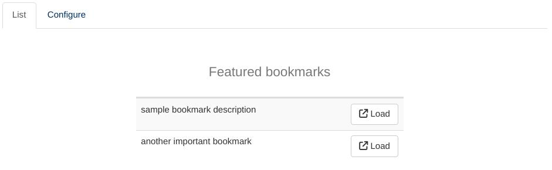
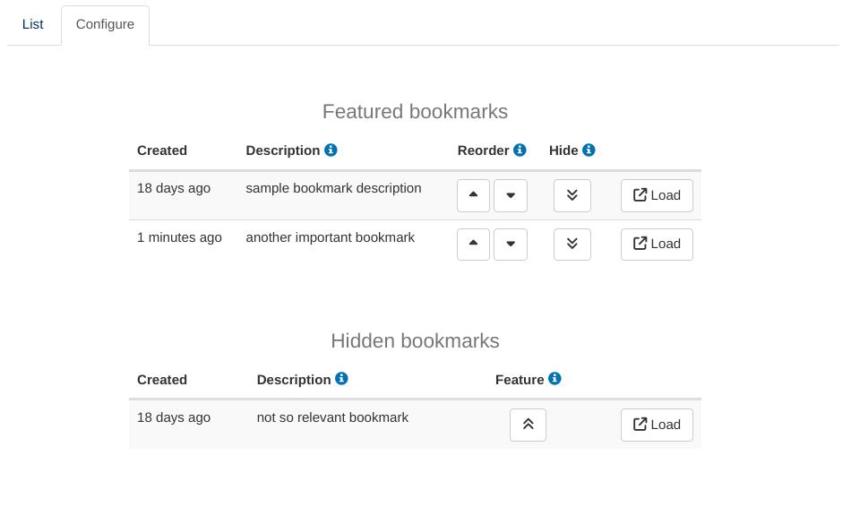

```{r, include = FALSE}
knitr::opts_chunk$set(
  collapse = TRUE,
  comment = "#>"
)
```
The Bookmark Manager module provides a centralized view of all server bookmarks created by users of a DaVinci app.
It can also be used by any shiny application configured with `shiny::enableBookmarking(store = 'server')`, 
`shiny::shinyApp(..., enableBookmarking = 'server')` or equivalent mechanisms.

The module offers two tabs ("List" and "Configure"). Most users are only expected to interact with the former:
 
This listing contains a curated subset of all bookmarks available for the application. It is functionally equivalent
to users sharing bookmarks and storing them on their browsers but may be more convenient for close-knit groups of users
that want a unified repository of bookmarks.

The second tab allows to review all available bookmarks, describe them, sort them and decide which to make available
on the 'List' tab of the module:
 

The "Hidden Bookmarks" table does not currently offer a sorting mechanism and instead sorts them from newest to oldest.
The expected workflow is for users to create a bookmark, transition to the 'Configure' tab, find it on top of the Hidden
table, describe it and move it onto the Featured table. The expectation is that non-featured bookmarks of a certain age
become less and less relevant and this default behavior reflects that and takes advantage of it to simplify the module
interface.

# Usage
Adding the Bookmark Manager module to a DaVinci application usually requires appending a single extra line to the 
`module_list` parameter of `dv.manager::run_app`:
`r # nolint start`
```{r, eval=FALSE}
"Bookmarks" = dv.bookman::mod_bookman()
```
`r # nolint end`

This is how it would look like in context:

`r # nolint start # styler: off`
```{r, eval=FALSE}
app <- function() {
  dataset <- ...

  module_list <- list(
    "Tab 1" = mod_1(module_id = "mod1"), ...,
    "Bookmarks" = dv.bookman::mod_bookman()
  )

  dv.manager::run_app(
    data = list("DS" = dataset),
    module_list = module_list,
    filter_data = "adsl"
  )
}
```
`r # nolint end # styler: on`

Notice that the call to `mod_bookman` does not require a module ID. That is because it does not make sense to include 
it more than once inside an application and a default ID is enough. The module signature still offers the possibility
of changing that default ID:
```{r, eval=FALSE}
mod_bookman <- function(module_id = "_bookman", bookmark_dir = NULL)
```
The second parameter to the module, `bookmark_dir`, overrides the auto-detection of the server bookmark folder.

# Internals

The module collects information from the standard server bookmark files `input.rds` and `values.rds` and writes an index
of featured bookmarks and descriptions to the root of the bookmark folder, under the file `bookmark_info.rds`.

The name and location of that file are part of the documented interface of this module because they are relevant for some 
aspects of the life cycle of an application, such as backups. The *contents* of that file should be considered unspecified
for the purposes of this manual, except to say that they will remain backwards compatible. Any `bookmark_info.rds` file
created with an earlier version of the Bookmark Manager module will work as expected on newer versions but the converse is
not guaranteed.
